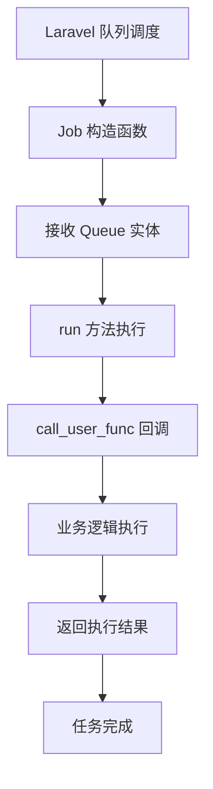

# 延迟队列任务类

## 概述

DelayQueue Job 模块包含延迟队列的任务执行类，负责实际执行延迟任务的业务逻辑。

## 核心类

### Job 类 (`Job.php`)

延迟队列的核心任务执行类，继承自 `DLaravel\Queue\QueueJob`。

#### 类定义

```php
namespace DLaravel\Helper\Job;

use DLaravel\Dto\Queue;
use DLaravel\Queue\QueueJob;

class Job extends QueueJob
{
    public function __construct(public Queue $arg) {}

    public function run(): bool
    {
        // 执行回调方法
        $res = call_user_func(
            [$this->arg->runClass, $this->arg->runMethod],
            $this->arg->runParam
        );
        return true;
    }

    public function payload()
    {
        return $this->arg;
    }
}
```

#### 核心功能

1. **接收 Queue 实体**: 构造函数接收包含任务信息的 Queue 实体
2. **执行回调方法**: 使用 `call_user_func` 执行指定的类方法
3. **返回执行结果**: 提供任务执行状态和结果
4. **调试支持**: 包含 `dump` 输出用于调试

#### 执行流程



## 使用示例

### 基本使用

```php
use DLaravel\Dto\Queue;
use DLaravel\Helper\Job\Job;

// 创建 Queue 实体
$queue = new Queue();
$queue->create_ts = time();
$queue->delay_ts = 10;
$queue->runClass = SomeService::class;
$queue->runMethod = 'someMethod';
$queue->runParam = ['param1' => 'value1'];

// 创建并分发任务
$job = new Job($queue);
Job::dispatch($queue)->delay(10);
```

### 回调方法示例

```php
class ExampleService
{
    /**
     * 延迟队列回调方法
     *
     * @param array $runParam 运行参数
     * @return mixed
     */
    public static function processDelayedTask(array $runParam)
    {
        $userId = $runParam['user_id'];
        $action = $runParam['action'];

        // 执行业务逻辑
        switch ($action) {
            case 'update_stats':
                return self::updateUserStats($userId);
            case 'send_notification':
                return self::sendNotification($userId, $runParam['message']);
            default:
                throw new \InvalidArgumentException("未知操作: {$action}");
        }
    }

    private static function updateUserStats($userId)
    {
        // 更新用户统计
        return true;
    }

    private static function sendNotification($userId, $message)
    {
        // 发送通知
        return true;
    }
}
```

## 错误处理

### 异常处理

Job 类继承了 `DLaravel\Queue\QueueJob` 的错误处理机制：

```php
// 基类会自动处理以下情况：
// 1. 任务执行异常
// 2. 重试机制
// 3. 失败任务记录
// 4. 日志记录
```

### 自定义错误处理

```php
class CustomJob extends Job
{
    public function run(): bool
    {
        try {
            $result = call_user_func(
                [$this->arg->runClass, $this->arg->runMethod],
                $this->arg->runParam
            );

            // 记录成功日志
            $this->logInfo('延迟任务执行成功', [
                'class' => $this->arg->runClass,
                'method' => $this->arg->runMethod,
                'result' => $result
            ]);

            return true;
        } catch (\Exception $e) {
            // 记录错误日志
            $this->logError('延迟任务执行失败', [
                'class' => $this->arg->runClass,
                'method' => $this->arg->runMethod,
                'error' => $e->getMessage(),
                'params' => $this->arg->runParam
            ]);

            throw $e; // 重新抛出异常，触发重试机制
        }
    }
}
```

## 调试和监控

### 调试输出

当前 Job 类包含调试输出：

```php
public function run(): bool
{
    // 调试输出任务信息
    dump($this->arg, [$this->arg->runClass, $this->arg->runMethod]);

    $res = call_user_func([$this->arg->runClass, $this->arg->runMethod], $this->arg->runParam);

    // 调试输出执行结果
    dump($res);

    return true;
}
```

**注意**: 生产环境建议移除或替换为日志记录。

### 监控建议

```php
// 添加性能监控
public function run(): bool
{
    $startTime = microtime(true);

    try {
        $result = call_user_func(
            [$this->arg->runClass, $this->arg->runMethod],
            $this->arg->runParam
        );

        $executionTime = microtime(true) - $startTime;

        // 记录性能指标
        $this->logInfo('任务执行完成', [
            'execution_time' => $executionTime,
            'memory_usage' => memory_get_usage(true),
            'class' => $this->arg->runClass,
            'method' => $this->arg->runMethod
        ]);

        return true;
    } catch (\Exception $e) {
        $executionTime = microtime(true) - $startTime;

        $this->logError('任务执行失败', [
            'execution_time' => $executionTime,
            'error' => $e->getMessage(),
            'class' => $this->arg->runClass,
            'method' => $this->arg->runMethod
        ]);

        throw $e;
    }
}
```

## 最佳实践

### 1. 回调方法设计

```php
// ✅ 推荐：静态方法，清晰的参数
public static function processUser(array $params)
{
    $userId = $params['user_id'];
    $action = $params['action'];
    // 处理逻辑
}

// ❌ 不推荐：实例方法，复杂的依赖
public function processUser($userId, $action, $dependency1, $dependency2)
{
    // 处理逻辑
}
```

### 2. 参数传递

```php
// ✅ 推荐：结构化参数
$runParam = [
    'user_id' => 123,
    'action' => 'update_stats',
    'timestamp' => time(),
    'metadata' => ['source' => 'api']
];

// ❌ 不推荐：简单值或复杂对象
$runParam = 123; // 太简单
$runParam = $userObject; // 可能序列化问题
```

### 3. 错误恢复

```php
public static function robustMethod(array $params)
{
    try {
        return self::primaryLogic($params);
    } catch (\Exception $e) {
        // 记录错误但不中断
        Log::warning('主逻辑失败，尝试备用方案', [
            'error' => $e->getMessage(),
            'params' => $params
        ]);

        return self::fallbackLogic($params);
    }
}
```

## 相关文档

- [延迟队列主文档](../README.md)
- [Queue 实体文档](../Entity/README.md)
- [控制台命令文档](../Console/README.md)
- [DLaravel 队列系统文档](../../../DLaravel/Queue/README.md)
