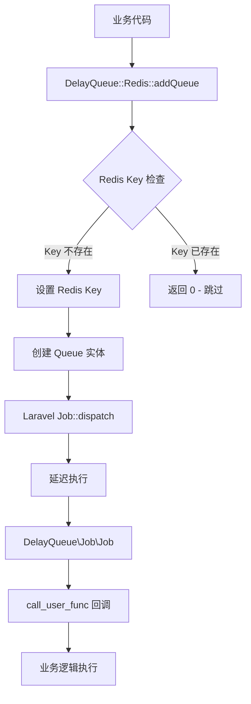

# 延迟队列模块 (DelayQueue)

## 📋 目录

- [概述](#概述)
- [架构设计](#架构设计)
- [核心组件](#核心组件)
- [使用方法](#使用方法)
- [配置说明](#配置说明)
- [监控管理](#监控管理)
- [最佳实践](#最佳实践)
- [故障排除](#故障排除)
- [与其他队列系统的对比](#与其他队列系统的对比)

## 概述

DelayQueue 是基于 Redis 的延迟队列模块，为项目提供了高效的延迟任务处理能力。该模块结合了 Redis 的过期机制和 Laravel 队列系统，实现了防重复、可靠的延迟任务调度。

### 🎯 主要特性

- **防重复机制**: 基于 Redis 键值对的防重复任务添加
- **灵活延迟**: 支持秒级延迟时间配置
- **回调机制**: 支持类方法回调，灵活性高
- **自动调度**: 与 Laravel 队列系统无缝集成
- **高可靠性**: 基于 Redis 持久化和队列系统的双重保障

### 🔧 适用场景

- **分层延迟处理**: 如 URS 推荐关系的分级更新
- **防雪崩处理**: 避免大量并发操作造成系统压力
- **数据一致性**: 确保数据更新的顺序性和完整性
- **系统解耦**: 将耗时操作从主流程中分离

## 架构设计

### 🏗️ 整体架构



### 🔄 执行流程

1. **任务添加**: 业务代码调用 `Redis::addQueue()` 方法
2. **防重复检查**: 检查 Redis 中是否已存在相同任务
3. **Redis 锁定**: 设置带过期时间的 Redis 键
4. **队列调度**: 通过 Laravel 队列系统延迟执行
5. **任务执行**: 到达延迟时间后执行回调方法
6. **自动清理**: Redis 键自动过期，释放锁定

## 核心组件

### 📦 目录结构

```
app/Module/DelayQueue/
├── Console/                    # 控制台命令
│   ├── DelayQueueRun.php      # 延迟队列运行命令
│   └── README.md              # 控制台文档
├── Entity/                     # 实体类
│   ├── Queue.php              # 队列实体
│   └── README.md              # 实体文档
├── Job/                        # 队列任务
│   ├── Job.php                # 延迟队列任务类
│   └── README.md              # 任务文档
├── Redis.php                   # Redis 延迟队列核心类
└── README.md                   # 模块文档
```

### 🔧 核心类详解

#### 1. Redis 类 (`Redis.php`)

延迟队列的核心控制类，提供任务添加和管理功能。

**主要方法**:
- `addQueue($callback, $runParam, $delay = 3)`: 添加延迟任务

**防重复机制**:
```php
$key = self::E_KEY . $callback[0] . $callback[1];
if ($a->exists($key)) {
    return 0; // 任务已存在，跳过
}
$a->setex($key, $delay, 1); // 设置过期键
```

#### 2. Queue 实体 (`Entity/Queue.php`)

队列任务的数据载体，包含任务执行所需的所有信息。

**属性说明**:
- `create_ts`: 创建时间戳
- `delay_ts`: 延迟时间（秒）
- `runClass`: 执行类名
- `runMethod`: 执行方法名
- `runParam`: 执行参数

#### 3. Job 任务类 (`Job/Job.php`)

继承自 `DLaravel\Queue\QueueJob` 的延迟队列任务执行器。

**核心功能**:
- 接收 Queue 实体作为参数
- 使用 `call_user_func` 执行回调方法
- 提供调试输出和日志记录

#### 4. 控制台命令 (`Console/DelayQueueRun.php`)

继承自 `DLaravel\Console\CommandSecond` 的定时执行命令。

**配置参数**:
- `waitSecond = 3`: 等待时间
- `sleepSecond = 2`: 间隔时长
- `signature = 'app-delayqueue:run'`: 命令签名

## 使用方法

### 🚀 基本用法

#### 1. 添加延迟任务

```php
use DLaravel\Helper\Redis;

// 基本用法
$callback = [SomeClass::class, 'someMethod'];
$runParam = ['param1' => 'value1', 'param2' => 'value2'];
$delay = 10; // 延迟 10 秒

$result = Redis::addQueue($callback, $runParam, $delay);

if ($result === 1) {
    echo "任务添加成功";
} else {
    echo "任务已存在，跳过重复添加";
}
```

#### 2. 实际业务示例

```php
// URS 推荐关系更新示例
$callback = [UrsTalentUpstreamUpdateService::class, 'updateTalentLevel'];
$runParam = [
    'referrer_id' => 12345,
    'original_user_id' => 67890,
    'level' => 2,
    'trigger_time' => time()
];
$delaySeconds = 5;

$result = \DLaravel\Helper\Redis::addQueue($callback, $runParam, $delaySeconds);
```

#### 3. 分层延迟处理

```php
// 根据层级设置不同延迟时间
$delaySeconds = match($level) {
    1 => 0,           // 直接上级：即时处理
    2 => 5,           // 上上级：延时5秒
    3 => 10,          // 第3级：延时10秒
    4 => 15,          // 第4级：延时15秒
    default => min(($level - 1) * 5, 60) // 最大延时60秒
};

Redis::addQueue($callback, $runParam, $delaySeconds);
```

### 📝 回调方法要求

回调方法必须满足以下条件：

1. **可调用性**: 必须是有效的 callable
2. **静态方法**: 推荐使用静态方法
3. **参数接收**: 能够接收 `$runParam` 参数
4. **异常处理**: 妥善处理可能的异常

```php
class ExampleService
{
    /**
     * 延迟队列回调方法示例
     *
     * @param array $runParam 运行参数
     * @return mixed
     */
    public static function delayedMethod(array $runParam)
    {
        try {
            // 业务逻辑处理
            $userId = $runParam['user_id'];
            $action = $runParam['action'];

            // 执行具体操作
            self::performAction($userId, $action);

            return true;
        } catch (\Exception $e) {
            // 错误处理
            Log::error('延迟队列任务执行失败', [
                'params' => $runParam,
                'error' => $e->getMessage()
            ]);
            throw $e;
        }
    }
}
```

## 配置说明

### ⚙️ Redis 配置

延迟队列依赖 Redis 配置，确保以下配置正确：

```php
// config/database.php 中的 Redis 配置
'redis' => [
    'client' => env('REDIS_CLIENT', 'phpredis'),
    'default' => [
        'host' => env('REDIS_HOST', '127.0.0.1'),
        'password' => env('REDIS_PASSWORD', null),
        'port' => env('REDIS_PORT', 6379),
        'database' => env('REDIS_DB', 0),
    ],
],
```

### 🔧 队列配置

确保 Laravel 队列系统正确配置：

```php
// config/queue.php
'default' => env('QUEUE_CONNECTION', 'redis'),

'connections' => [
    'redis' => [
        'driver' => 'redis',
        'connection' => env('REDIS_QUEUE_CONNECTION', 'default'),
        'queue' => env('REDIS_QUEUE', 'default'),
        'retry_after' => (int) env('REDIS_QUEUE_RETRY_AFTER', 90),
        'block_for' => null,
        'after_commit' => false,
    ],
],
```

### 📊 环境变量

```bash
# Redis 配置
REDIS_HOST=127.0.0.1
REDIS_PASSWORD=null
REDIS_PORT=6379
REDIS_DB=0

# 队列配置
QUEUE_CONNECTION=redis
REDIS_QUEUE_CONNECTION=default
REDIS_QUEUE=default
REDIS_QUEUE_RETRY_AFTER=90
```

## 监控管理

### 📈 监控指标

#### 1. Redis 键监控

```bash
# 查看延迟队列相关的 Redis 键
redis-cli KEYS "delay_queue*"

# 查看特定键的 TTL
redis-cli TTL "delay_queue_key"
```

#### 2. 队列状态监控

```bash
# 查看队列状态
php artisan queue:monitor

# 查看失败任务
php artisan queue:failed

# 重试失败任务
php artisan queue:retry all
```

### 📊 日志监控

延迟队列会产生以下日志：

```php
// 任务添加日志
Log::info('添加DelayQueue延时更新任务', [
    'callback_class' => $callback[0],
    'callback_method' => $callback[1],
    'delay_seconds' => $delaySeconds,
    'params' => $runParam
]);

// 任务执行日志
Log::info('DelayQueue任务执行', [
    'job_class' => Job::class,
    'callback' => $callback,
    'result' => $result
]);
```

### 🔍 调试工具

#### 1. 测试命令

```bash
# 测试延迟队列功能
php artisan test:urs-talent-upstream
```

#### 2. 队列工作进程

```bash
# 启动队列工作进程
php artisan queue:work

# 指定队列启动
php artisan queue:work --queue=default

# 后台运行
nohup php artisan queue:work > /dev/null 2>&1 &
```

## 最佳实践

### ✅ 推荐做法

#### 1. 合理设置延迟时间

```php
// 根据业务重要性设置延迟时间
$delaySeconds = match($priority) {
    'high' => 1,      // 高优先级：1秒
    'normal' => 5,    // 普通优先级：5秒
    'low' => 30,      // 低优先级：30秒
    default => 10     // 默认：10秒
};
```

#### 2. 参数验证

```php
// 添加任务前验证参数
if (!is_callable($callback)) {
    throw new \InvalidArgumentException('回调方法不可调用');
}

if (empty($runParam) || !is_array($runParam)) {
    throw new \InvalidArgumentException('运行参数必须是非空数组');
}

if ($delay < 0 || $delay > 3600) {
    throw new \InvalidArgumentException('延迟时间必须在 0-3600 秒之间');
}
```

#### 3. 错误处理

```php
try {
    $result = Redis::addQueue($callback, $runParam, $delay);

    if ($result === 0) {
        Log::info('任务已存在，跳过重复添加', $runParam);
    } else {
        Log::info('任务添加成功', $runParam);
    }
} catch (\Exception $e) {
    Log::error('添加延迟队列任务失败', [
        'callback' => $callback,
        'params' => $runParam,
        'error' => $e->getMessage()
    ]);

    // 根据业务需要决定是否重新抛出异常
    throw $e;
}
```

#### 4. 幂等性设计

```php
// 确保回调方法具有幂等性
public static function updateUserStats(array $params)
{
    $userId = $params['user_id'];

    // 重新计算而不是累加，确保幂等性
    $stats = self::calculateUserStats($userId);

    // 直接更新而不是增量更新
    User::where('id', $userId)->update([
        'total_score' => $stats['total_score'],
        'level' => $stats['level'],
        'updated_at' => now()
    ]);
}
```

### ❌ 避免的做法

#### 1. 避免过短的延迟时间

```php
// ❌ 不推荐：过短的延迟时间可能导致系统压力
Redis::addQueue($callback, $runParam, 0.1);

// ✅ 推荐：至少 1 秒的延迟时间
Redis::addQueue($callback, $runParam, 1);
```

#### 2. 避免过长的延迟时间

```php
// ❌ 不推荐：过长的延迟时间可能导致业务延迟
Redis::addQueue($callback, $runParam, 7200); // 2小时

// ✅ 推荐：合理的延迟时间
Redis::addQueue($callback, $runParam, 60); // 1分钟
```

#### 3. 避免在回调中添加新的延迟任务

```php
// ❌ 不推荐：可能导致无限循环
public static function processData($params)
{
    // 处理数据
    self::handleData($params);

    // 又添加新的延迟任务
    Redis::addQueue([self::class, 'processData'], $params, 10);
}
```

## 故障排除

### 🔧 常见问题

#### 1. 任务不执行

**症状**: 添加任务成功，但任务从不执行

**可能原因**:
- 队列工作进程未启动
- Redis 连接问题
- 回调方法不存在或不可调用

**解决方案**:
```bash
# 检查队列工作进程
ps aux | grep "queue:work"

# 启动队列工作进程
php artisan queue:work

# 检查 Redis 连接
redis-cli ping

# 检查失败任务
php artisan queue:failed
```

#### 2. 重复任务问题

**症状**: 相同任务被重复执行

**可能原因**:
- Redis 键生成逻辑问题
- 回调参数不同导致键不同

**解决方案**:
```php
// 检查键生成逻辑
$key = 'delay_queue' . $callback[0] . $callback[1];
echo "生成的键: " . $key;

// 确保相同业务使用相同的回调和参数
```

#### 3. 内存泄漏

**症状**: 队列工作进程内存持续增长

**可能原因**:
- 回调方法中有内存泄漏
- 大量对象未释放

**解决方案**:
```bash
# 定期重启队列工作进程
php artisan queue:restart

# 使用内存限制
php artisan queue:work --memory=512
```

#### 4. Redis 键堆积

**症状**: Redis 中存在大量过期的延迟队列键

**可能原因**:
- Redis 过期策略配置问题
- 键的 TTL 设置过长

**解决方案**:
```bash
# 检查 Redis 过期键
redis-cli KEYS "delay_queue*" | wc -l

# 手动清理过期键
redis-cli EVAL "return redis.call('del', unpack(redis.call('keys', ARGV[1])))" 0 "delay_queue*"
```

### 🔍 调试步骤

#### 1. 检查任务添加

```php
// 添加调试日志
Log::debug('准备添加延迟队列任务', [
    'callback' => $callback,
    'params' => $runParam,
    'delay' => $delay
]);

$result = Redis::addQueue($callback, $runParam, $delay);

Log::debug('延迟队列任务添加结果', [
    'result' => $result,
    'redis_key' => 'delay_queue' . $callback[0] . $callback[1]
]);
```

#### 2. 检查 Redis 状态

```bash
# 连接 Redis
redis-cli

# 查看所有延迟队列键
KEYS delay_queue*

# 查看特定键的信息
TTL delay_queue_SomeClass_someMethod
GET delay_queue_SomeClass_someMethod
```

#### 3. 检查队列状态

```bash
# 查看队列统计
php artisan queue:monitor

# 查看队列配置
php artisan config:show queue

# 测试队列连接
php artisan queue:work --once
```

## 与其他队列系统的对比

### 🆚 DelayQueue vs Laravel 原生延迟队列

| 特性 | DelayQueue | Laravel 延迟队列 |
|------|------------|------------------|
| **防重复机制** | ✅ 内置 Redis 防重复 | ❌ 需要手动实现 |
| **实现复杂度** | 🟡 中等 | 🟢 简单 |
| **性能开销** | 🟡 Redis + 队列双重开销 | 🟢 仅队列开销 |
| **可靠性** | 🟢 Redis 持久化保障 | 🟡 依赖队列驱动 |
| **灵活性** | 🟢 支持任意回调 | 🟡 需要定义 Job 类 |
| **监控能力** | 🟡 需要监控 Redis + 队列 | 🟢 Laravel 内置监控 |

### 📊 使用场景对比

#### DelayQueue 适用场景:
- 需要防重复的延迟任务
- 分层延迟处理（如推荐关系更新）
- 临时性的延迟操作
- 需要灵活回调的场景

#### Laravel 原生延迟队列适用场景:
- 标准的延迟任务处理
- 需要复杂任务逻辑的场景
- 需要任务序列化的场景
- 对性能要求较高的场景

### 🔄 迁移建议

如果需要从 DelayQueue 迁移到 Laravel 原生延迟队列：

```php
// DelayQueue 方式
Redis::addQueue([SomeService::class, 'someMethod'], $params, 10);

// Laravel 原生方式
SomeJob::dispatch($params)->delay(10);
```

## 总结

DelayQueue 模块为项目提供了一个功能强大、防重复的延迟队列解决方案。通过结合 Redis 的过期机制和 Laravel 队列系统，实现了高可靠性的延迟任务处理。

### 🎯 核心优势

1. **防重复机制**: 自动防止重复任务添加
2. **灵活配置**: 支持任意延迟时间和回调方法
3. **高可靠性**: 基于 Redis 和队列系统的双重保障
4. **易于使用**: 简单的 API 接口，易于集成

### 🚀 适用场景

- 分层数据更新（如 URS 推荐关系）
- 防雪崩处理
- 系统解耦
- 延迟通知发送

### 📈 性能考虑

- Redis 内存使用：每个任务占用少量内存
- 网络开销：Redis 操作 + 队列操作
- 处理延迟：最小 1 秒，建议 5 秒以上

通过合理使用 DelayQueue 模块，可以有效提升系统的稳定性和用户体验。
