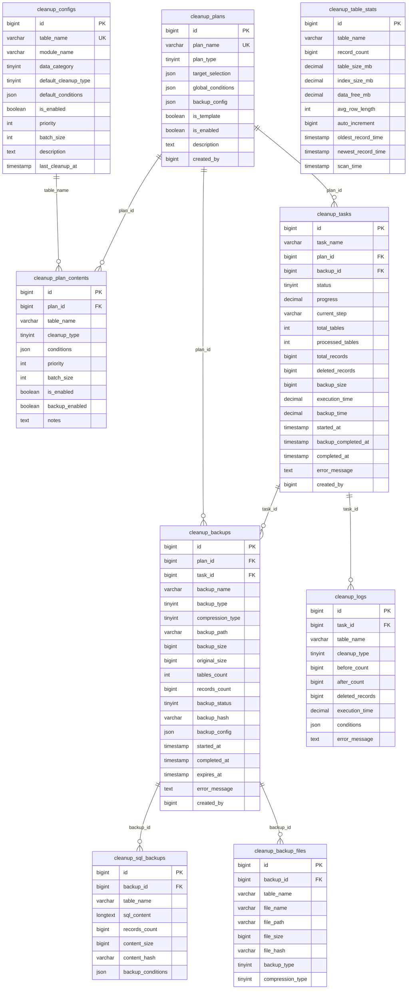

# Cleanup 模块数据库设计

> 本文档基于实际代码结构梳理，反映当前数据库的真实设计状态
>
> 最后更新时间：2025年06月17日 11:58

## 1. 数据库表概览

Cleanup 模块包含以下核心数据表：

1. **cleanup_configs** - 清理配置表（基础表配置）
2. **cleanup_plans** - 清理计划表（如"农场模块清理"）
3. **cleanup_plan_contents** - 计划内容表（计划具体处理哪些表，怎么清理）
4. **cleanup_tasks** - 清理任务表（执行某个计划的具体实例）
5. **cleanup_backups** - 备份记录表（计划的备份方案和内容）
6. **cleanup_backup_files** - 备份文件表（备份文件详细信息）
7. **cleanup_sql_backups** - SQL备份记录表（备份的具体SQL内容）
8. **cleanup_logs** - 清理日志表（任务执行日志）
9. **cleanup_table_stats** - 表统计信息表（表的统计信息）

### 1.1 表前缀说明
所有表都使用 `cleanup_` 前缀，符合项目的命名规范。

### 1.2 数据库引擎
所有表都使用 InnoDB 引擎，支持事务和外键约束。

## 2. 表结构详细设计

### 2.1 清理配置表 (cleanup_configs)

存储每个数据表的基础清理配置信息。

#### 字段说明
| 字段名 | 类型 | 约束 | 默认值 | 说明 |
|--------|------|------|--------|------|
| id | bigint unsigned | PK, AUTO_INCREMENT | - | 主键ID |
| table_name | varchar(100) | NOT NULL, UNIQUE | - | 表名 |
| module_name | varchar(50) | NOT NULL | - | 模块名称 |
| data_category | tinyint unsigned | NOT NULL | - | 数据分类:1用户数据,2日志数据,3交易数据,4缓存数据,5配置数据 |
| default_cleanup_type | tinyint unsigned | NOT NULL | - | 默认清理类型:1清空表,2删除所有,3按时间删除,4按用户删除,5按条件删除 |
| default_conditions | json | NULL | NULL | 默认清理条件JSON配置 |
| is_enabled | tinyint(1) | NOT NULL | 1 | 是否启用清理 |
| priority | int unsigned | NOT NULL | 100 | 清理优先级(数字越小优先级越高) |
| batch_size | int unsigned | NOT NULL | 1000 | 批处理大小 |
| description | text | NULL | NULL | 配置描述 |
| last_cleanup_at | timestamp | NULL | NULL | 最后清理时间 |
| created_at | timestamp | NULL | CURRENT_TIMESTAMP | 创建时间 |
| updated_at | timestamp | NULL | CURRENT_TIMESTAMP ON UPDATE | 更新时间 |

#### 索引设计
- **PRIMARY**: `id` (主键)
- **UNIQUE**: `idx_table_name` (`table_name`) - 确保每个表只有一个配置
- **INDEX**: `idx_module_category` (`module_name`, `data_category`) - 按模块和分类查询
- **INDEX**: `idx_enabled_priority` (`is_enabled`, `priority`) - 按启用状态和优先级查询
- **INDEX**: `idx_last_cleanup` (`last_cleanup_at`) - 按最后清理时间查询

#### 模型关联
- **Model**: `App\Module\Cleanup\Models\CleanupConfig`
- **关联**: 无直接关联，通过 `table_name` 字段与其他表建立逻辑关系

### 2.2 清理计划表 (cleanup_plans)

存储清理计划信息，如"农场模块清理"。

#### 字段说明
| 字段名 | 类型 | 约束 | 默认值 | 说明 |
|--------|------|------|--------|------|
| id | bigint unsigned | PK, AUTO_INCREMENT | - | 主键ID |
| plan_name | varchar(100) | NOT NULL, UNIQUE | - | 计划名称 |
| plan_type | tinyint unsigned | NOT NULL | - | 计划类型:1全量清理,2模块清理,3分类清理,4自定义清理,5混合清理 |
| target_selection | json | NULL | NULL | 目标选择配置 |
| global_conditions | json | NULL | NULL | 全局清理条件 |
| backup_config | json | NULL | NULL | 备份配置 |
| is_template | tinyint(1) | NOT NULL | 0 | 是否为模板 |
| is_enabled | tinyint(1) | NOT NULL | 1 | 是否启用 |
| description | text | NULL | NULL | 计划描述 |
| created_by | bigint unsigned | NULL | NULL | 创建者用户ID |
| created_at | timestamp | NULL | CURRENT_TIMESTAMP | 创建时间 |
| updated_at | timestamp | NULL | CURRENT_TIMESTAMP ON UPDATE | 更新时间 |

#### 索引设计
- **PRIMARY**: `id` (主键)
- **UNIQUE**: `idx_plan_name` (`plan_name`) - 确保计划名称唯一
- **INDEX**: `idx_plan_type` (`plan_type`) - 按计划类型查询
- **INDEX**: `idx_is_template` (`is_template`) - 按模板状态查询
- **INDEX**: `idx_is_enabled` (`is_enabled`) - 按启用状态查询
- **INDEX**: `idx_created_by` (`created_by`) - 按创建者查询

#### 模型关联
- **Model**: `App\Module\Cleanup\Models\CleanupPlan`
- **关联**:
  - `hasMany` → `CleanupPlanContent` (计划内容)
  - `hasMany` → `CleanupTask` (清理任务)
  - `hasMany` → `CleanupBackup` (备份记录)

### 2.3 计划内容表 (cleanup_plan_contents)

存储计划的具体内容，即计划具体处理哪些表，怎么清理。

#### 字段说明
| 字段名 | 类型 | 约束 | 默认值 | 说明 |
|--------|------|------|--------|------|
| id | bigint unsigned | PK, AUTO_INCREMENT | - | 主键ID |
| plan_id | bigint unsigned | NOT NULL, FK | - | 计划ID |
| table_name | varchar(100) | NOT NULL | - | 表名 |
| cleanup_type | tinyint unsigned | NOT NULL | - | 清理类型:1清空表,2删除所有,3按时间删除,4按用户删除,5按条件删除 |
| conditions | json | NULL | NULL | 清理条件JSON配置 |
| priority | int unsigned | NOT NULL | 100 | 清理优先级 |
| batch_size | int unsigned | NOT NULL | 1000 | 批处理大小 |
| is_enabled | tinyint(1) | NOT NULL | 1 | 是否启用 |
| backup_enabled | tinyint(1) | NOT NULL | 1 | 是否启用备份 |
| notes | text | NULL | NULL | 备注说明 |
| created_at | timestamp | NULL | CURRENT_TIMESTAMP | 创建时间 |
| updated_at | timestamp | NULL | CURRENT_TIMESTAMP ON UPDATE | 更新时间 |

#### 索引设计
- **PRIMARY**: `id` (主键)
- **UNIQUE**: `idx_plan_table` (`plan_id`, `table_name`) - 确保计划中每个表只有一个配置
- **INDEX**: `idx_plan_id` (`plan_id`) - 按计划查询
- **INDEX**: `idx_table_name` (`table_name`) - 按表名查询
- **INDEX**: `idx_priority` (`priority`) - 按优先级查询

#### 外键约束
- **FK**: `plan_id` → `cleanup_plans.id` (CASCADE DELETE)

#### 模型关联
- **Model**: `App\Module\Cleanup\Models\CleanupPlanContent`
- **关联**:
  - `belongsTo` → `CleanupPlan` (所属计划)
  - `belongsTo` → `CleanupConfig` (关联配置，通过table_name)

### 2.4 清理任务表 (cleanup_tasks)

存储清理任务的执行信息和状态，即执行某个计划的具体实例。

#### 字段说明
| 字段名 | 类型 | 约束 | 默认值 | 说明 |
|--------|------|------|--------|------|
| id | bigint unsigned | PK, AUTO_INCREMENT | - | 主键ID |
| task_name | varchar(100) | NOT NULL | - | 任务名称 |
| plan_id | bigint unsigned | NOT NULL, FK | - | 关联的清理计划ID |
| backup_id | bigint unsigned | NULL | NULL | 关联的备份ID |
| status | tinyint unsigned | NOT NULL | 1 | 任务状态:1待执行,2备份中,3执行中,4已完成,5已失败,6已取消,7已暂停 |
| progress | decimal(5,2) | NOT NULL | 0.00 | 执行进度百分比 |
| current_step | varchar(50) | NULL | NULL | 当前执行步骤 |
| total_tables | int unsigned | NOT NULL | 0 | 总表数 |
| processed_tables | int unsigned | NOT NULL | 0 | 已处理表数 |
| total_records | bigint unsigned | NOT NULL | 0 | 总记录数 |
| deleted_records | bigint unsigned | NOT NULL | 0 | 已删除记录数 |
| backup_size | bigint unsigned | NOT NULL | 0 | 备份文件大小(字节) |
| execution_time | decimal(10,3) | NOT NULL | 0.000 | 执行时间(秒) |
| backup_time | decimal(10,3) | NOT NULL | 0.000 | 备份时间(秒) |
| started_at | timestamp | NULL | NULL | 开始时间 |
| backup_completed_at | timestamp | NULL | NULL | 备份完成时间 |
| completed_at | timestamp | NULL | NULL | 完成时间 |
| error_message | text | NULL | NULL | 错误信息 |
| created_by | bigint unsigned | NULL | NULL | 创建者用户ID |
| created_at | timestamp | NULL | CURRENT_TIMESTAMP | 创建时间 |
| updated_at | timestamp | NULL | CURRENT_TIMESTAMP ON UPDATE | 更新时间 |

#### 索引设计
- **PRIMARY**: `id` (主键)
- **INDEX**: `idx_plan_id` (`plan_id`) - 按计划查询
- **INDEX**: `idx_backup_id` (`backup_id`) - 按备份查询
- **INDEX**: `idx_status` (`status`) - 按状态查询
- **INDEX**: `idx_created_by` (`created_by`) - 按创建者查询
- **INDEX**: `idx_created_at` (`created_at`) - 按创建时间查询

#### 外键约束
- **FK**: `plan_id` → `cleanup_plans.id` (CASCADE DELETE)

#### 模型关联
- **Model**: `App\Module\Cleanup\Models\CleanupTask`
- **关联**:
  - `belongsTo` → `CleanupPlan` (所属计划)
  - `belongsTo` → `CleanupBackup` (关联备份)
  - `hasMany` → `CleanupLog` (清理日志)

### 2.5 备份记录表 (cleanup_backups)

存储计划的备份方案和备份内容。

#### 字段说明
| 字段名 | 类型 | 约束 | 默认值 | 说明 |
|--------|------|------|--------|------|
| id | bigint unsigned | PK, AUTO_INCREMENT | - | 主键ID |
| plan_id | bigint unsigned | NOT NULL | - | 计划ID |
| task_id | bigint unsigned | NULL | NULL | 清理任务ID |
| backup_name | varchar(100) | NOT NULL | - | 备份名称 |
| backup_type | tinyint unsigned | NOT NULL | - | 备份类型:1数据库备份,2文件备份,3混合备份 |
| compression_type | tinyint unsigned | NOT NULL | 1 | 压缩类型:1无压缩,2GZIP,3ZIP |
| backup_path | varchar(500) | NOT NULL | - | 备份路径 |
| backup_size | bigint unsigned | NOT NULL | 0 | 备份文件大小(字节) |
| original_size | bigint unsigned | NOT NULL | 0 | 原始大小(字节) |
| tables_count | int unsigned | NOT NULL | 0 | 备份表数量 |
| records_count | bigint unsigned | NOT NULL | 0 | 备份记录数量 |
| backup_status | tinyint unsigned | NOT NULL | 1 | 备份状态:1进行中,2已完成,3已失败 |
| backup_hash | varchar(64) | NULL | NULL | 备份文件哈希 |
| backup_config | json | NULL | NULL | 备份配置 |
| started_at | timestamp | NULL | NULL | 备份开始时间 |
| completed_at | timestamp | NULL | NULL | 备份完成时间 |
| expires_at | timestamp | NULL | NULL | 备份过期时间 |
| error_message | text | NULL | NULL | 错误信息 |
| created_by | bigint unsigned | NULL | NULL | 创建者用户ID |
| created_at | timestamp | NULL | CURRENT_TIMESTAMP | 创建时间 |
| updated_at | timestamp | NULL | CURRENT_TIMESTAMP ON UPDATE | 更新时间 |

#### 索引设计
- **PRIMARY**: `id` (主键)
- **INDEX**: `idx_plan_id` (`plan_id`) - 按计划查询
- **INDEX**: `idx_task_id` (`task_id`) - 按任务查询
- **INDEX**: `idx_backup_status` (`backup_status`) - 按状态查询
- **INDEX**: `idx_expires_at` (`expires_at`) - 按过期时间查询
- **INDEX**: `idx_created_at` (`created_at`) - 按创建时间查询

#### 模型关联
- **Model**: `App\Module\Cleanup\Models\CleanupBackup`
- **关联**:
  - `belongsTo` → `CleanupPlan` (所属计划)
  - `belongsTo` → `CleanupTask` (关联任务)
  - `hasMany` → `CleanupSqlBackup` (SQL备份记录)
  - `hasMany` → `CleanupBackupFile` (备份文件记录)

### 2.6 SQL备份记录表 (cleanup_sql_backups)

存储备份的具体SQL内容信息。

#### 字段说明
| 字段名 | 类型 | 约束 | 默认值 | 说明 |
|--------|------|------|--------|------|
| id | bigint unsigned | PK, AUTO_INCREMENT | - | 主键ID |
| backup_id | bigint unsigned | NOT NULL, FK | - | 关联备份记录ID |
| table_name | varchar(100) | NOT NULL | - | 表名 |
| sql_content | longtext | NOT NULL | - | INSERT语句内容 |
| records_count | bigint unsigned | NOT NULL | 0 | 记录数量 |
| content_size | bigint unsigned | NOT NULL | 0 | 内容大小(字节) |
| content_hash | varchar(64) | NULL | NULL | 内容SHA256哈希 |
| backup_conditions | json | NULL | NULL | 备份条件 |
| created_at | timestamp | NULL | CURRENT_TIMESTAMP | 创建时间 |

#### 索引设计
- **PRIMARY**: `id` (主键)
- **INDEX**: `idx_backup_id` (`backup_id`) - 按备份查询
- **INDEX**: `idx_table_name` (`table_name`) - 按表名查询
- **INDEX**: `idx_records_count` (`records_count`) - 按记录数查询
- **INDEX**: `idx_content_size` (`content_size`) - 按内容大小查询

#### 外键约束
- **FK**: `backup_id` → `cleanup_backups.id` (CASCADE DELETE)

#### 模型关联
- **Model**: `App\Module\Cleanup\Models\CleanupSqlBackup`
- **关联**:
  - `belongsTo` → `CleanupBackup` (所属备份)

### 2.7 清理日志表 (cleanup_logs)

记录任务执行的详细日志。

#### 字段说明
| 字段名 | 类型 | 约束 | 默认值 | 说明 |
|--------|------|------|--------|------|
| id | bigint unsigned | PK, AUTO_INCREMENT | - | 主键ID |
| task_id | bigint unsigned | NOT NULL, FK | - | 任务ID |
| table_name | varchar(100) | NOT NULL | - | 表名 |
| cleanup_type | tinyint unsigned | NOT NULL | - | 清理类型:1清空表,2删除所有,3按时间删除,4按用户删除,5按条件删除 |
| before_count | bigint unsigned | NOT NULL | 0 | 清理前记录数 |
| after_count | bigint unsigned | NOT NULL | 0 | 清理后记录数 |
| deleted_records | bigint unsigned | NOT NULL | 0 | 删除记录数 |
| execution_time | decimal(8,3) | NOT NULL | 0.000 | 执行时间(秒) |
| conditions | json | NULL | NULL | 使用的清理条件 |
| error_message | text | NULL | NULL | 错误信息 |
| created_at | timestamp | NULL | CURRENT_TIMESTAMP | 创建时间 |

#### 索引设计
- **PRIMARY**: `id` (主键)
- **INDEX**: `idx_task_id` (`task_id`) - 按任务查询
- **INDEX**: `idx_table_name` (`table_name`) - 按表名查询
- **INDEX**: `idx_cleanup_type` (`cleanup_type`) - 按清理类型查询
- **INDEX**: `idx_created_at` (`created_at`) - 按创建时间查询

#### 外键约束
- **FK**: `task_id` → `cleanup_tasks.id` (CASCADE DELETE)

#### 模型关联
- **Model**: `App\Module\Cleanup\Models\CleanupLog`
- **关联**:
  - `belongsTo` → `CleanupTask` (所属任务)

### 2.8 表统计信息表 (cleanup_table_stats)

存储数据表的统计信息，用于清理决策。

#### 字段说明
| 字段名 | 类型 | 约束 | 默认值 | 说明 |
|--------|------|------|--------|------|
| id | bigint unsigned | PK, AUTO_INCREMENT | - | 主键ID |
| table_name | varchar(100) | NOT NULL | - | 表名 |
| record_count | bigint unsigned | NOT NULL | 0 | 记录总数 |
| table_size_mb | decimal(10,2) | NOT NULL | 0.00 | 表大小(MB) |
| index_size_mb | decimal(10,2) | NOT NULL | 0.00 | 索引大小(MB) |
| data_free_mb | decimal(10,2) | NOT NULL | 0.00 | 碎片空间(MB) |
| avg_row_length | int unsigned | NOT NULL | 0 | 平均行长度 |
| auto_increment | bigint unsigned | NULL | NULL | 自增值 |
| oldest_record_time | timestamp | NULL | NULL | 最早记录时间 |
| newest_record_time | timestamp | NULL | NULL | 最新记录时间 |
| scan_time | timestamp | NOT NULL | CURRENT_TIMESTAMP | 扫描时间 |
| created_at | timestamp | NULL | CURRENT_TIMESTAMP | 创建时间 |
| updated_at | timestamp | NULL | CURRENT_TIMESTAMP ON UPDATE | 更新时间 |

#### 索引设计
- **PRIMARY**: `id` (主键)
- **INDEX**: `idx_table_name` (`table_name`) - 按表名查询
- **INDEX**: `idx_record_count` (`record_count`) - 按记录数查询
- **INDEX**: `idx_table_size` (`table_size_mb`) - 按表大小查询
- **INDEX**: `idx_scan_time` (`scan_time`) - 按扫描时间查询

#### 模型关联
- **Model**: `App\Module\Cleanup\Models\CleanupTableStats`
- **关联**: 无直接关联，独立存在用于统计分析

### 2.9 备份文件表 (cleanup_backup_files)

存储备份文件的详细信息。

#### 字段说明
| 字段名 | 类型 | 约束 | 默认值 | 说明 |
|--------|------|------|--------|------|
| id | bigint unsigned | PK, AUTO_INCREMENT | - | 主键ID |
| backup_id | bigint unsigned | NOT NULL, FK | - | 备份记录ID |
| table_name | varchar(100) | NOT NULL | - | 表名 |
| file_name | varchar(255) | NOT NULL | - | 文件名 |
| file_path | varchar(500) | NOT NULL | - | 文件路径 |
| file_size | bigint unsigned | NOT NULL | 0 | 文件大小(字节) |
| file_hash | varchar(64) | NULL | NULL | 文件哈希 |
| backup_type | tinyint unsigned | NOT NULL | - | 备份类型 |
| compression_type | tinyint unsigned | NOT NULL | 1 | 压缩类型 |
| created_at | timestamp | NULL | CURRENT_TIMESTAMP | 创建时间 |

#### 索引设计
- **PRIMARY**: `id` (主键)
- **INDEX**: `idx_backup_id` (`backup_id`) - 按备份查询
- **INDEX**: `idx_table_name` (`table_name`) - 按表名查询

#### 外键约束
- **FK**: `backup_id` → `cleanup_backups.id` (CASCADE DELETE)

#### 模型关联
- **Model**: `App\Module\Cleanup\Models\CleanupBackupFile`
- **关联**:
  - `belongsTo` → `CleanupBackup` (所属备份)

## 3. 枚举类型定义

### 3.1 清理类型 (CLEANUP_TYPE)

| 值 | 名称 | 描述 | 需要条件 | 可回滚 |
|----|------|------|----------|--------|
| 1 | TRUNCATE | 清空表 | 否 | 否 |
| 2 | DELETE_ALL | 删除所有记录 | 否 | 是 |
| 3 | DELETE_BY_TIME | 按时间删除 | 是 | 是 |
| 4 | DELETE_BY_USER | 按用户删除 | 是 | 是 |
| 5 | DELETE_BY_CONDITION | 按条件删除 | 是 | 是 |

### 3.2 数据分类 (DATA_CATEGORY)

| 值 | 名称 | 描述 | 默认启用 | 默认清理类型 | 默认优先级 |
|----|------|------|----------|--------------|------------|
| 1 | USER_DATA | 用户运行数据 | 否 | DELETE_BY_TIME | 200 |
| 2 | LOG_DATA | 日志数据 | 是 | DELETE_BY_TIME | 50 |
| 3 | TRANSACTION_DATA | 交易数据 | 否 | DELETE_BY_TIME | 300 |
| 4 | CACHE_DATA | 缓存数据 | 是 | TRUNCATE | 10 |
| 5 | CONFIG_DATA | 配置数据 | 否 | DELETE_BY_CONDITION | 500 |

### 3.3 任务状态 (TASK_STATUS)

| 值 | 名称 | 描述 | 颜色 | 图标 | 可执行 | 可取消 | 可暂停 | 可恢复 |
|----|------|------|------|------|--------|--------|--------|--------|
| 1 | PENDING | 待执行 | warning | fa-clock | 是 | 是 | 否 | 否 |
| 2 | BACKING_UP | 备份中 | info | fa-download | 否 | 是 | 是 | 否 |
| 3 | RUNNING | 执行中 | primary | fa-spinner | 否 | 是 | 是 | 否 |
| 4 | COMPLETED | 已完成 | success | fa-check-circle | 否 | 否 | 否 | 否 |
| 5 | FAILED | 已失败 | danger | fa-times-circle | 否 | 否 | 否 | 否 |
| 6 | CANCELLED | 已取消 | secondary | fa-ban | 否 | 否 | 否 | 否 |
| 7 | PAUSED | 已暂停 | warning | fa-pause-circle | 否 | 是 | 否 | 是 |

### 3.4 计划类型 (PLAN_TYPE)

| 值 | 名称 | 描述 | 颜色 | 图标 | 需要目标选择 |
|----|------|------|------|------|-------------|
| 1 | ALL | 全量清理 | danger | fa-globe | 否 |
| 2 | MODULE | 模块清理 | primary | fa-cubes | 是 |
| 3 | CATEGORY | 分类清理 | info | fa-tags | 是 |
| 4 | CUSTOM | 自定义清理 | warning | fa-cog | 是 |
| 5 | MIXED | 混合清理 | secondary | fa-layer-group | 是 |

### 3.5 备份类型 (BACKUP_TYPE)

| 值 | 名称 | 描述 | 文件扩展名 | MIME类型 | 支持结构 |
|----|------|------|------------|----------|----------|
| 1 | DATABASE | 数据库备份 | .sql | application/sql | 是 |
| 2 | FILE | 文件备份 | .tar | application/x-tar | 否 |
| 3 | MIXED | 混合备份 | .zip | application/zip | 是 |

### 3.6 压缩类型 (COMPRESSION_TYPE)

| 值 | 名称 | 描述 | 文件扩展名 | 压缩级别 |
|----|------|------|------------|----------|
| 1 | NONE | 无压缩 | - | 0 |
| 2 | GZIP | GZIP压缩 | .gz | 6 |
| 3 | ZIP | ZIP压缩 | .zip | 6 |

### 3.7 备份状态 (BACKUP_STATUS)

| 值 | 名称 | 描述 |
|----|------|------|
| 1 | IN_PROGRESS | 进行中 |
| 2 | COMPLETED | 已完成 |
| 3 | FAILED | 已失败 |

## 4. JSON字段结构

### 4.1 清理条件JSON (conditions)

#### 4.1.1 按时间清理条件
```json
{
  "time_field": "created_at",
  "time_condition": "older_than",
  "time_value": 30,
  "time_unit": "days"
}
```

#### 4.1.2 按用户清理条件
```json
{
  "user_field": "user_id",
  "user_condition": "in",
  "user_values": [1, 2, 3]
}
```

#### 4.1.3 复合条件
```json
{
  "logic": "AND",
  "conditions": [
    {
      "field": "status",
      "operator": "=",
      "value": 0
    },
    {
      "field": "created_at",
      "operator": "<",
      "value": "2024-01-01 00:00:00"
    }
  ]
}
```

### 4.2 目标选择配置JSON (target_selection)

#### 3.2.1 自定义表选择
```json
{
  "selection_type": "custom",
  "tables": [
    "farm_users",
    "item_users",
    "pet_users",
    "farm_logs",
    "item_logs"
  ]
}
```

#### 3.2.2 按模块选择
```json
{
  "selection_type": "module",
  "modules": ["Farm", "GameItems"],
  "exclude_tables": ["farm_configs"]  // 可选：排除特定表
}
```

#### 3.2.3 按分类选择
```json
{
  "selection_type": "category",
  "categories": [1, 2],  // 用户数据和日志数据
  "exclude_tables": ["user_configs"]  // 可选：排除特定表
}
```

#### 3.2.4 全量选择
```json
{
  "selection_type": "all",
  "exclude_modules": ["Config"],  // 可选：排除特定模块
  "exclude_categories": [5],      // 可选：排除配置数据
  "exclude_tables": [             // 可选：排除特定表
    "farm_configs",
    "item_configs"
  ]
}
```

#### 3.2.5 混合选择
```json
{
  "selection_type": "mixed",
  "modules": ["Farm"],           // 包含Farm模块的所有表
  "categories": [2],             // 包含所有日志数据表
  "tables": [                    // 包含指定的表
    "pet_users",
    "shop_orders"
  ],
  "exclude_tables": [            // 排除特定表
    "farm_configs"
  ]
}
```

## 5. 数据关系设计

### 5.1 ER关系图



### 5.2 核心关系说明

#### 5.2.1 主要数据流
1. **配置扫描**: `cleanup_table_stats` ← 扫描数据库表 → `cleanup_configs`
2. **计划创建**: `cleanup_configs` → `cleanup_plans` → `cleanup_plan_contents`
3. **任务执行**: `cleanup_plans` → `cleanup_tasks` → `cleanup_logs`
4. **数据备份**: `cleanup_tasks` → `cleanup_backups` → `cleanup_sql_backups` / `cleanup_backup_files`

#### 5.2.2 关系约束
- **CASCADE DELETE**: 删除计划时自动删除相关的内容、任务、备份
- **FOREIGN KEY**: 确保数据完整性，防止孤立记录
- **UNIQUE KEY**: 确保业务唯一性约束

## 6. 索引设计总结

### 6.1 主键索引
所有表都使用自增的`id`字段作为主键，确保记录唯一性。

### 6.2 唯一索引
- `cleanup_configs.idx_table_name`: 确保每个表只有一个配置
- `cleanup_plans.idx_plan_name`: 确保计划名称唯一
- `cleanup_plan_contents.idx_plan_table`: 确保计划中每个表只有一个配置

### 6.3 外键索引
- `cleanup_plan_contents.idx_plan_id`: 计划内容按计划查询
- `cleanup_tasks.idx_plan_id`: 任务按计划查询
- `cleanup_logs.idx_task_id`: 日志按任务查询
- `cleanup_backups.idx_plan_id`: 备份按计划查询
- `cleanup_sql_backups.idx_backup_id`: SQL备份按备份查询

### 6.4 业务索引
- `cleanup_configs.idx_module_category`: 按模块和分类查询配置
- `cleanup_configs.idx_enabled_priority`: 按启用状态和优先级查询
- `cleanup_tasks.idx_status`: 按任务状态查询
- `cleanup_table_stats.idx_table_size`: 按表大小查询统计

## 7. 数据初始化与维护

### 7.1 自动初始化
- **表扫描**: 系统启动时自动扫描所有数据表
- **配置生成**: 为每个表自动生成默认清理配置
- **分类识别**: 根据表名和字段自动识别数据分类

### 7.2 默认清理规则
- **日志表**: 默认保留30天，使用按时间删除
- **缓存表**: 默认使用清空表方式
- **用户数据表**: 默认禁用清理，需手动配置
- **配置表**: 默认禁用清理，防止误删

### 7.3 定期维护
- **统计更新**: 每日更新表统计信息
- **配置优化**: 根据统计信息调整清理策略
- **日志清理**: 定期清理过期的操作日志
- **备份清理**: 定期清理过期的备份文件

## 8. 性能优化策略

### 8.1 查询优化
- **索引覆盖**: 为常用查询创建复合索引
- **分页查询**: 大数据量使用分页避免内存溢出
- **条件过滤**: 优先使用索引字段进行条件过滤

### 8.2 操作优化
- **分批处理**: 大表删除使用批量操作
- **事务控制**: 合理使用事务确保数据一致性
- **并发控制**: 避免同时执行多个清理任务

### 8.3 存储优化
- **数据压缩**: 备份文件使用压缩减少存储空间
- **分区存储**: 大表考虑按时间分区
- **碎片整理**: 定期整理表碎片提高性能
