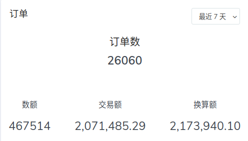
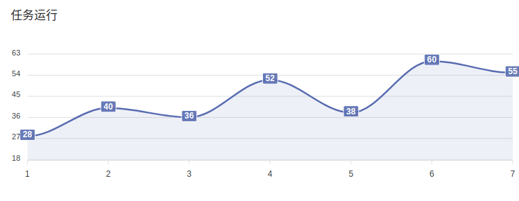
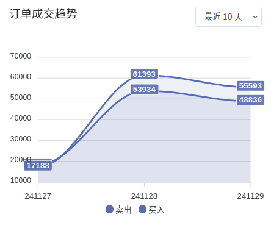
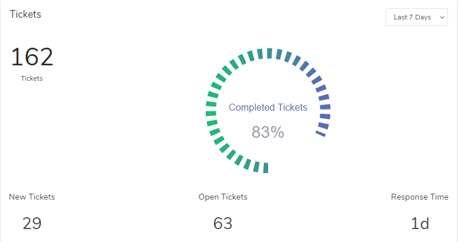
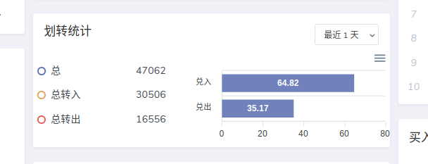

# 演示

## 总览

## 多数字数据 DataNumber

## 多数字数据 - 单行 NumberS2

## 多数字数据 - 单列 NumberS

## 待标签的走势图 DataLabel

## 待标签的走势图 - 有参数 DataLabel2

## Tickets

## 排行榜 Ranking

## 圆环型卡片 Round

## bar卡片 DataBar

